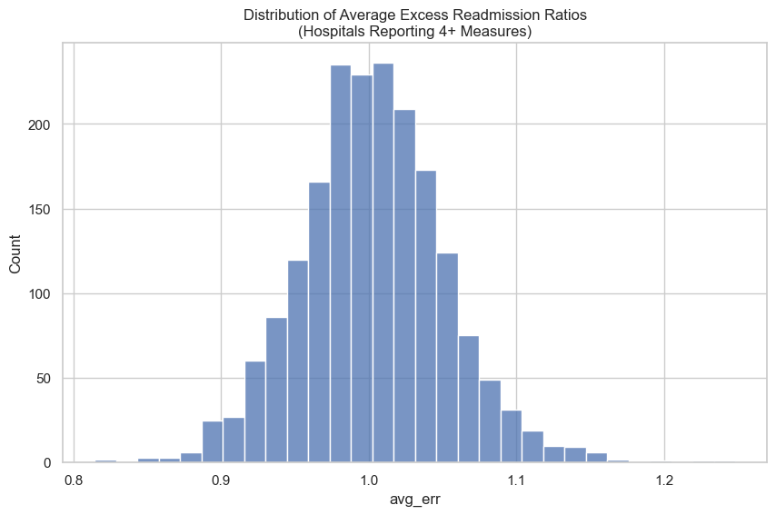
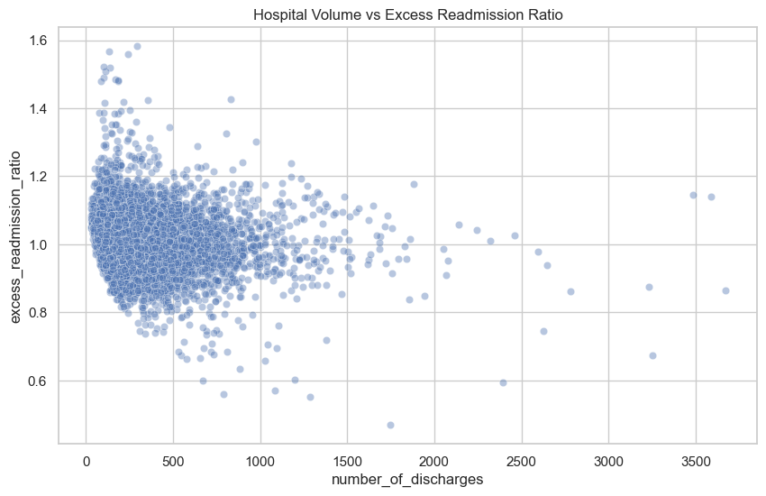
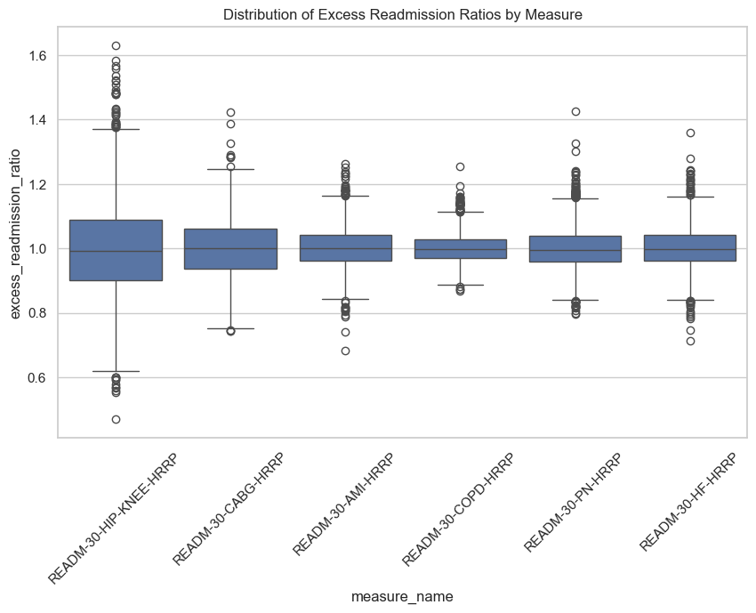

# Hospital Readmissions Reduction Program (HRRP) Analysis

## Project Overview

Hospital readmissions are an important healthcare quality metric and are closely monitored through the Centers for Medicare & Medicaid Services (CMS) Hospital Readmissions Reduction Program (HRRP). Hospitals with excess readmissions for certain conditions may face financial penalties.

This project analyzes HRRP performance data to identify patterns in readmission outcomes across hospitals, states and medical conditions. The goal is to uncover potential opportunities for quality improvement and support data-driven decision-making.

## Business Problem

Hospital administrators and quality improvement teams need to understand which factors are associated with higher readmission rates in order to prioritize interventions and reduce avoidable readmissions.

Without a clear understanding of performance patterns, organizations may struggle to allocate resources effectively or identify areas requiring additional attention.

## Stakeholders

- Hospital Leadership
- Quality Improvement Teams
- Clinical Operations Leaders
- Healthcare Policy Analysts

## Business Questions

1. Which HRRP measures have the highest excess readmission ratios?
2. How does readmission performance vary across states?
3. Is hospital volume associated with readmission performance?
4. Which hospitals consistently outperform or underperform expectations?
5. Which hospitals present the greatest opportunities for quality improvement?

## Dataset

Source: Center for Medicare & Medicaid Services (CMS) Hospital Readmissions Reduction Program (HRRP)

Key Variables:

- Facility Name
- State
- Readmission Measure
- Number of Discharges
- Excess Readmission Ratio
- Predicted Readmission Rate
- Expected Readmission Rate

## Success Criteria

The analysis will identify meaningful patterns and actionable insights that could help healthcare stakeholders better understand readmission performance and prioritize improvement initiatives.

## Key Findings

- Readmission performance was broadly similar across HRRP measure categories.
- State-level variation was relatively modest.
- Hospital volume showed a weak inverse relationship with excess readmission ratios.
- Hospital-level variation was substantially larger than variation observed across states or measures.
- Among hospitals reporting four or more HRRP measures, average excess readmission ratios ranged from 0.81 to 1.25.

## Power BI Dashboard

### Executive Overview

Interactive dashboard summarizing readmissiion performance across 2,774 hospitals, 51 states, and six HRRP measures. The dashboard highlights variation across clinical conditions and geographic locations and provides high-level view of overall HRRP performance.

### Hospital Performance

Hospital-level analysis examining the relationship between discharge volume and excess readmission ratios. Includes rankings of top-performing and underperforming hospitals to support quality improvement and benchmarking efforts.

## Selected Visualizations

### Distribution of Average Excess Readmission Ratios



Most hospitals clustered around expected performance levels, although a subset exhibited substantially higher excess readmission ratios.

### Hospital Volume vs Excess Readmission Ratio



Hospital volume exhibited a weak inverse relationship with readmission performance (r = -0.13).

### Distribution of Excess Readmission Ratios by Measure



Variation within measures was greater than difference between measures.

### Tools Used

 - Python
 - Pandas
 - Seaborn
 - Matplotlib
 - Jupyter Notebook

## Methodology

The analysis followed the data analytics lifecycle:

1. Data Cleaning and Preparation
    - Removed records with missing readmission metrics
    - Selected variables relevant to HRRP performance
    - Creaded an analysis-ready dataset

2. Exploratory Data Analysis
    - Evaluated performance across measures, states, and hospitals
    - Assessed relationships between hospital volume and readmission outcomes
    - Identified high- and low-performing facilities

3. Reporting and Visualization
    - Developed visualizations to support findings
    - Produced an executive summary with recommendations

## Project Structure

```text
hospital-readmissions-analysis/
│
├── data/
│   ├── raw/
│   └── processed/
│
├── notebooks/
│   ├── 01_hrrp_data_cleaning.ipynb
│   └── 02_hrrp_data_EDA.ipynb
│
├── images/
│   ├── hospital_distribution.png
│   ├── readmission_ratio_by_measure.png
│   ├── volume_vs_readmission.png
│   ├── dashboard_overview.png
│   └── dashboard_hospital_performance.png
│
├── reports/
│   └── HRRP_Executive_Summary.pdf
│
└── README.md
```

## Executive Summary

A stakeholder-focused summary of findings and recommendations is available below:

[HRRP Executive Summary](reports/HRRP_Executive_Summary.pdf)

## Recommendations

- Focus quality improvement efforts on hospitals with elevated excess readmission ratios.
- Investigate operational practices of high-performing hospitals.
- Benchmark facilities that consistently outperform expectations.
- Prioritize review of hospitals with ratios substantially above 1.0

## Business Impact

The analysis suggests that hospital-level operational factors may play a larger role in readmission performance than geography, condition type, or hospital size. These findings can help healthcare organizations prioritize quality improvement initiatives and allocate resources more effectively.
